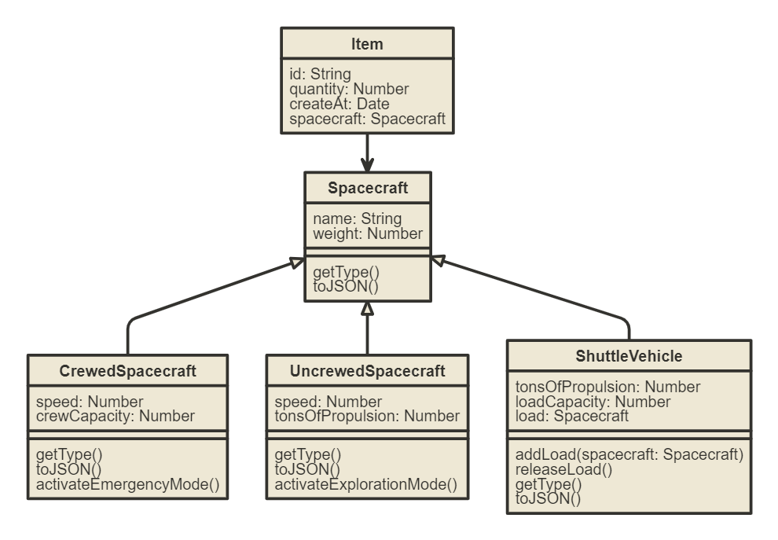

# Spacecraft Inventory App

Amazing project that contains a Spacecraft Inventory where you can add various types of spacecrafts with different features to the Inventory. This is a serverlerss application that uses the following technology: React as Frontend Framework with Material UI and Firestore from Firebase for handling all the database.

The project uses Github Actions for the continous deployment into GitHub Pages.

## Architecture

This applications uses a layer architecture. Its divied into UI Layer and CORE Layer.

### UI
The UI folder is responsible for the user interaface tha ti was buitl with react and material ui. It sues hooks like usesState and useEffect for cotnroling the behavipor uin the screen.

We have react roptuer for contñlrillor all the url in the apploication. We have 3 urls:
* `/`:  Go to InverotyScren
* `/new`: fro crateing a new itean and spacerfract
* `/item/:id`: for udpatint her quaintty or delete item

### Core
The core folder is repsoinsible for having our services and our  object model. That contianets all the logic and bussiens rules.

#### Model

* `Item`: .This is the first list item.
* `Spacecraft`: This is the first list item.
* `ShuttleVehicle`: This is the first list item.
* `UncrewedSpacecraft`: This is the first list item.* * `CrewedSpacecraft`: This is the first list item.

#### Service
This layer aloows to communciate wiht firestro and convert the simple objtec that are stroed into custom objects like Item, Stapce.bla bla. THis process uses a firestroe conveter call `itemConverteR`.

For the process 'toFirestore' we use the method toJSON that allows ud to convert from custom objects to simple obejcts. This methjdos is overwrinting in each subtypes like CroweSpace,. UNcreem, cargaeto.

For the process 'fromFirestore' we use the  'SpacecraftFactory' for creatng new obejcts

## Available Scripts

In the project directory, you can run:

### `npm start`

Runs the app in the development mode.\
Open [http://localhost:3000](http://localhost:3000) to view it in your browser.

The page will reload when you make changes.\
You may also see any lint errors in the console.

### `npm run build`

Builds the app for production to the `build` folder.\
It correctly bundles React in production mode and optimizes the build for the best performance.

The build is minified and the filenames include the hashes.\
Your app is ready to be deployed!

